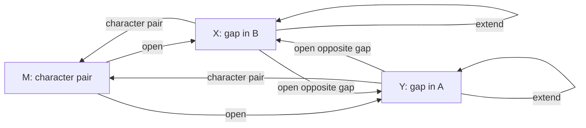

# Algorithm

`affine-align` computes an exact pairwise global alignment using a
three-state dynamic program. The design follows the affine-gap formulation
introduced by Gotoh while making the scoring convention and boundary
conditions explicit.

## Scoring model

For sequences $A=a_1\ldots a_m$ and $B=b_1\ldots b_n$, a character pair
scores

$$
s(a_i,b_j)=
\begin{cases}
\omega, & a_i=b_j,\\
-\mu, & a_i\ne b_j,
\end{cases}
$$

where $\omega$ is the match score and $\mu\ge 0$ is the mismatch penalty.
A contiguous gap of length $k\ge 1$ receives

$$
g(k)=-\left(\sigma+(k-1)\varepsilon\right),
$$

where $\sigma\ge 0$ is the gap-open penalty and $\varepsilon\ge 0$ is the
gap-extension penalty. This convention matters: a one-character gap costs
exactly $\sigma$.

## Three dynamic-programming states

At grid coordinate $(i,j)$:

- $M_{i,j}$ ends by aligning $a_i$ with $b_j$;
- $X_{i,j}$ ends with $a_i$ aligned to a gap in $B$;
- $Y_{i,j}$ ends with a gap in $A$ aligned to $b_j$.

The recurrences are

$$
\begin{aligned}
M_{i,j}
&=\max\{M_{i-1,j-1},X_{i-1,j-1},Y_{i-1,j-1}\}
  +s(a_i,b_j),\\
X_{i,j}
&=\max\{X_{i-1,j}-\varepsilon,\,
         M_{i-1,j}-\sigma,\,
         Y_{i-1,j}-\sigma\},\\
Y_{i,j}
&=\max\{Y_{i,j-1}-\varepsilon,\,
         M_{i,j-1}-\sigma,\,
         X_{i,j-1}-\sigma\}.
\end{aligned}
$$

Transitions between $X$ and $Y$ are retained because the command-line
interface accepts arbitrary non-negative penalties. When two gap openings are
cheaper than one mismatch, the mathematically optimal alignment can contain
adjacent gaps in opposite sequences.

## Boundary conditions

$$
\begin{aligned}
M_{0,0}&=0,\\
X_{i,0}&=-\sigma-(i-1)\varepsilon &&(i\ge1),\\
Y_{0,j}&=-\sigma-(j-1)\varepsilon &&(j\ge1).
\end{aligned}
$$

All other states along row zero or column zero are set to $-\infty$. The
optimal score is

$$
\max\{M_{m,n},X_{m,n},Y_{m,n}\}.
$$

## Traceback and memory layout

Only the previous and current score rows are kept in memory. For each grid
cell, the implementation stores three predecessor states in one byte:

- 2 bits for the predecessor of $M$;
- 2 bits for the predecessor of $X$;
- 2 bits for the predecessor of $Y$.

This removes the three full `double` score matrices used by a straightforward
implementation. The running time is $O(mn)$; score storage is $O(n)$, and
the traceback table is $O(mn)$ bytes.

No floating-point equality comparisons are used during traceback. Each
predecessor is recorded when its score is selected, with a documented,
deterministic tie-breaking order.

## Correctness sketch

Every valid alignment prefix ending at $(i,j)$ belongs to exactly one of the
three states. Removing its final column gives one of the predecessor prefixes
listed in that state's recurrence. Conversely, appending the corresponding
column to any listed predecessor yields a valid alignment in the target state.
Induction over increasing $i+j$ therefore shows that each state contains the
best score for its class. Taking the maximum at $(m,n)$ gives the globally
optimal score, and the stored predecessors reconstruct an alignment attaining
it.

## References

1. Needleman, S. B., & Wunsch, C. D. (1970). A general method applicable to
   the search for similarities in the amino acid sequence of two proteins.
   *Journal of Molecular Biology, 48*(3), 443-453.
   <https://doi.org/10.1016/0022-2836(70)90057-4>
2. Gotoh, O. (1982). An improved algorithm for matching biological sequences.
   *Journal of Molecular Biology, 162*(3), 705-708.
   <https://doi.org/10.1016/0022-2836(82)90398-9>
